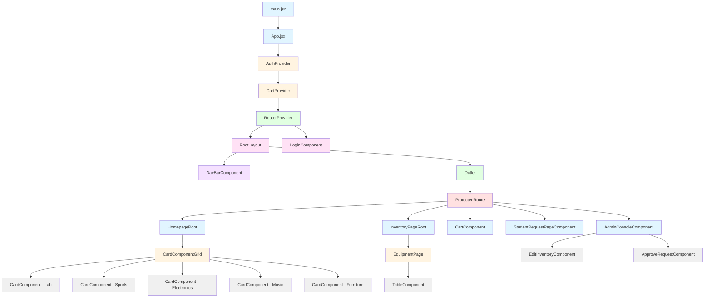

# Component Hierarchy Diagram

## Component Descriptions

### Entry Point
- **main.jsx**: Application entry point that renders the App component

### Root Components
- **App.jsx**: Main application component that wraps the app with context providers and router
- **AuthProvider**: Context provider for authentication state
- **CartProvider**: Context provider for shopping cart state
- **RouterProvider**: React Router provider that manages routing

### Layout Components
- **RootLayout**: Main layout component that includes navigation and outlet for child routes
- **NavBarComponent**: Navigation bar component with search, cart, and profile functionality
- **Outlet**: React Router outlet for rendering child routes

### Route Components
- **ProtectedRoute**: Wrapper component that protects routes based on user roles
- **LoginComponent**: Login page component (not protected)
- **HomepageRoot**: Homepage component
- **InventoryPageRoot**: Inventory listing page component
- **CartComponent**: Shopping cart component
- **StudentRequestPageComponent**: Student request management page
- **AdminConsoleComponent**: Admin console component with conditional rendering

### Feature Components
- **CardComponentGrid**: Grid container for category cards
- **CardComponent**: Individual category card (Lab, Sports, Electronics, Music, Furniture)
- **EquipmentPage**: Equipment listing page with search and filters
- **TableComponent**: Table component for displaying equipment items
- **EditInventoryComponent**: Admin component for editing inventory
- **ApproveRequestComponent**: Admin component for approving/rejecting requests

## Context Providers
- **AuthContext**: Provides authentication state (user, login, logout)
- **CartContext**: Provides cart state (cartItems, addToCart, removeFromCart, clearCart)

## Routing Structure
- `/` → RootLayout (with NavBarComponent)
  - `/home` → HomepageRoot (protected)
  - `/inventory/labs` → InventoryPageRoot (protected)
  - `/inventory/sports` → InventoryPageRoot (protected)
  - `/inventory/electronics` → InventoryPageRoot (protected)
  - `/inventory/music` → InventoryPageRoot (protected)
  - `/inventory/furniture` → InventoryPageRoot (protected)
  - `/cart` → CartComponent (protected)
  - `/student/requests` → StudentRequestPageComponent (protected)
  - `/admin/console/edit` → AdminConsoleComponent with EditInventoryComponent (admin only)
  - `/admin/console/request` → AdminConsoleComponent with ApproveRequestComponent (admin only)
- `/login` → LoginComponent (public)

